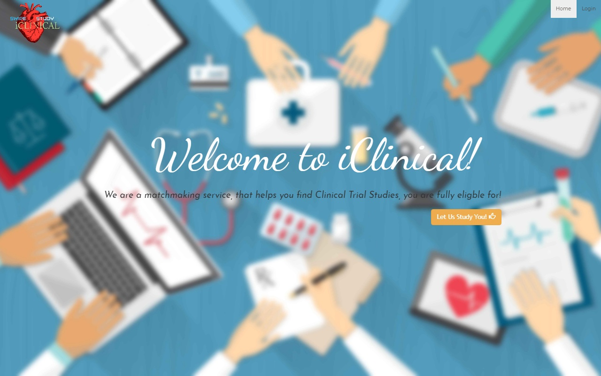
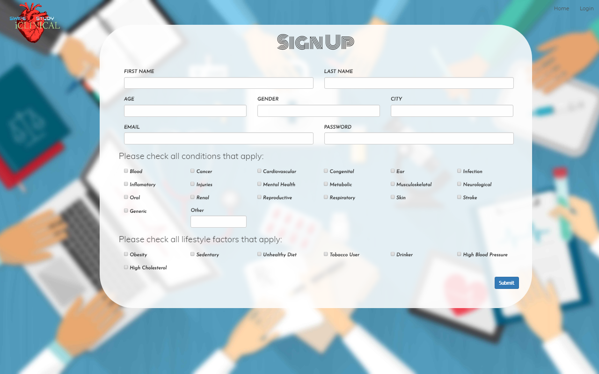
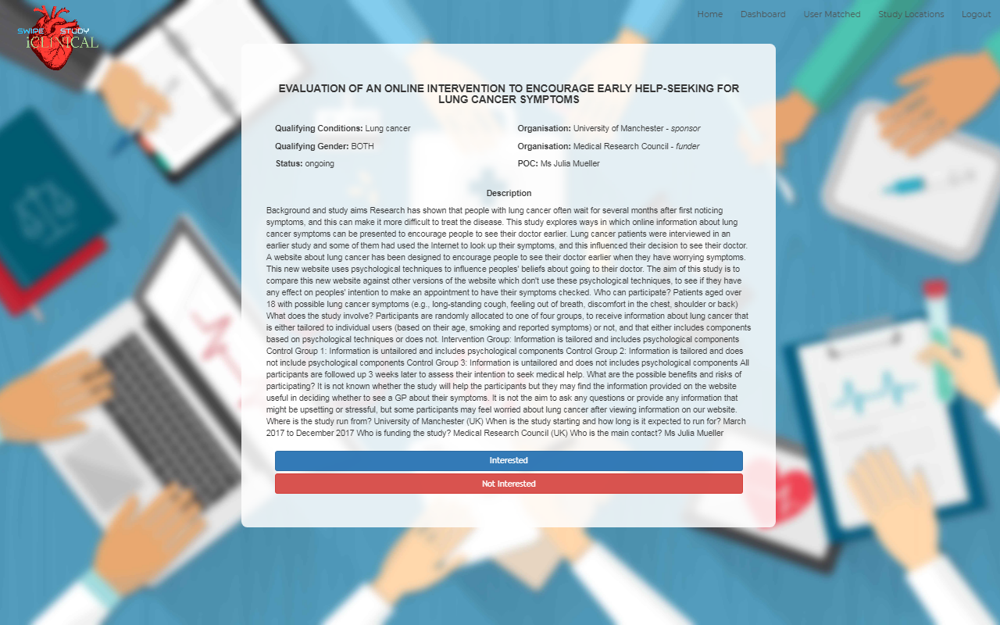

# iClinical
iClinical is a matchmaking service catered for the clinical research industry, it provides a way for potential canidates to find studies they qualify for and enables those canidates to be matched with a clinical research company running those studies. 

# Features 
- Implementation of a worldwide clinical trial database api from Opentrials.net.
- Utilizes ASP.NET framework for backend data handling.

# Technologies Used
	
	
	
	
	

# Examples
  
	
	                                       